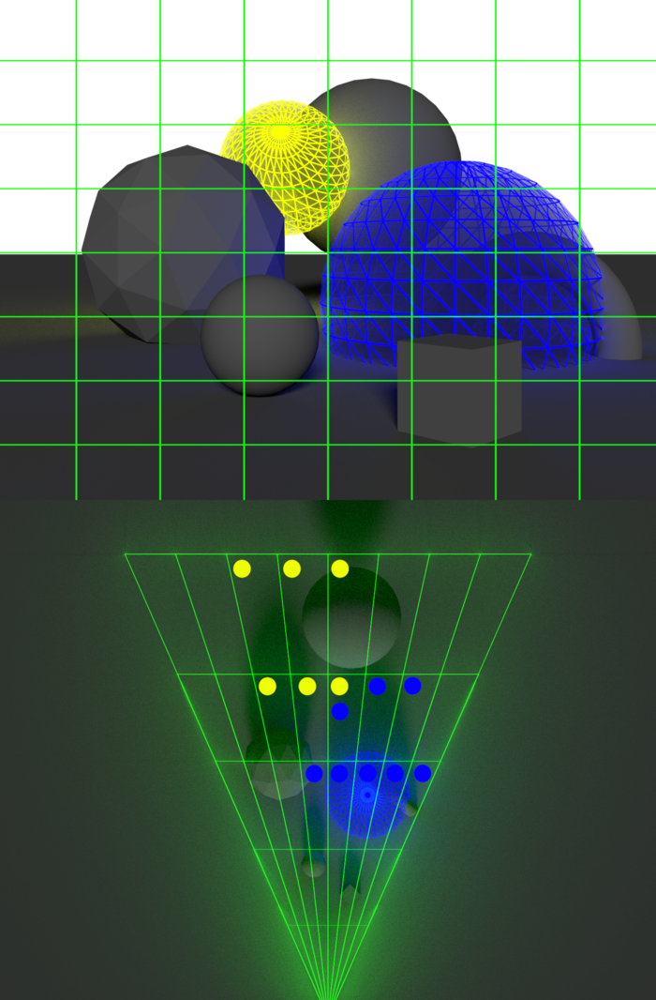

WebGL Forward+ and Clustered Deferred Shading
======================

**University of Pennsylvania, CIS 565: GPU Programming and Architecture, Project 4**

* Harry Guan
* Tested on: **Google Chrome 141.07** on
  Macbook Air M2 2022

## Description

This project implements Forward+ and Clustered Deferred shading techniques using WebGPU. It features three different rendering approaches: naive forward rendering, Forward+, and clustered deferred rendering using the Sponza Demo Scene. This was a great opportunity to learn a lot about WebGPU, which is the new trend replacing WebGL. 

### Live Demo

[Live Demo link!!](https://hazingoo.github.io/Project4-WebGPU-Forward-Plus-and-Clustered-Deferred/)

### Demo Video/GIF

[]

### Project Structure

```
Project4-WebGPU-Forward-Plus-and-Clustered-Deferred/
├── src/
│   ├── shaders/          # WGSL shader files for different rendering techniques
│   ├── renderers/        # Implementation files for naive, forward+, and deferred renderers
│   └── stage/           # Scene management, camera, and lighting components
├── scenes/sponza/       # Sponza scene assets and textures
├── package.json         # Project dependencies and scripts
└── vite.config.ts       # Build configuration
```

### How to run Code

1. **Install dependencies:**
   ```bash
   npm install
   ```

2. **Start the development server:**
   ```bash
   npm run dev
   ```

3. **Open your browser:**
   - Navigate to `http://localhost:5173/` (or the port shown in terminal)
   - Make sure you're using a WebGPU-compatible browser like Chrome 

4. **Controls:**
   - Use mouse to look around the scene
   - Use WASD keys to move around
   - Toggle between different rendering techniques using the GUI controls

## Feature Overview


This project uses the famous Sponza scene, a classic test environment in computer graphics that features a complex architectural model with detailed geometry, textures, and lighting conditions. The Sponza scene provides an excellent benchmark for testing different rendering techniques due to its intricate geometry, varied materials, and realistic lighting scenarios. It allows for comprehensive evaluation of rendering performance across different algorithms.

| 500 Lights | 2500 Lights | 5000 Lights |
|------------|-------------|-------------|
|  |  |  |


### Naive

The naive forward rendering approach serves as our baseline implementation, where every light in the scene is evaluated for every pixel during the fragment shader stage. This method is straightforward but computationally expensive, especially as the number of lights increases. While this approach provides the foundation for understanding basic lighting calculations, we will explore optimization efforts later on to improve performance and scalability.

### Forward+

Forward+ rendering is an optimization technique that divides the view frustum into 3D clusters and pre-computes which lights affect each cluster. This approach dramatically reduces the number of lights that need to be evaluated per pixel by only considering lights within the same cluster as the fragment. The clustering process uses compute shaders to efficiently cull lights against cluster bounding boxes, making it much more scalable than naive forward rendering when dealing with hundreds or thousands of lights.

 

### Clustered Deferred

Clustered Deferred rendering combines the benefits of deferred shading with light clustering for maximum performance. This two-pass technique first renders geometry information (position, normal, albedo) into a G-buffer, then performs lighting calculations in a fullscreen pass using the stored geometry data. The clustering optimization is applied to the lighting pass, ensuring only relevant lights are considered for each screen-space cluster. This approach separates geometry and lighting calculations, allowing for complex lighting models and better performance scaling with scene complexity. 

## Performance Analysis
All benchmarks are performed on my macbook air M2 2022

### I. Comparison and Analysis of Forward+ and Clustered Deferred Shading

**Is one of them faster?**


Based on the benchmark data, **Clustered Deferred is consistently the fastest**, followed by Forward+, with Naive being the slowest by a significant margin:

| Light Count | Naive (ms) | Forward+ (ms) | Clustered Deferred (ms) |
|-------------|------------|---------------|-------------------------|
| 1            | 8.9        | 9.4           | 7.8                     |
| 1000         | 2642.4     | 187.7         | 16.8                    |
| 2000         | 4214.7     | 370.3         | 105.5                   |
| 3000         | 8141.4     | 896.5         | 240.3                   |
| 4000         | 14486.4    | 1241.1        | 358.3                   |
| 5000         | 18153.4    | 1416.5        | 400.8                   |

**Is one of them better at certain types of workloads?**
- Forward+ performs better when geometry complexity is low but lighting complexity is high
- Clustered Deferred excels when geometry complexity is high, as it separates geometry and lighting calculations

**What are the benefits and tradeoffs of using one over the other?**

*Forward+ Benefits:*
- Single-pass rendering
- Lower memory bandwidth usage
- Simpler pipeline

*Forward+ Tradeoffs:*
- All geometry must be rendered for lighting calculations
- Less efficient for complex scenes with many overlapping objects

*Clustered Deferred Benefits:*
- Separates geometry and lighting calculations
- Better for complex scenes with many overlapping objects
- Enables advanced lighting techniques

*Clustered Deferred Tradeoffs:*
- Higher memory bandwidth usage (G-buffer)
- Two-pass rendering pipeline
- More complex implementation

**For any differences in performance, briefly explain what may be causing the difference:**

The dramatic performance differences are caused by the algorithmic complexity:

- **Naive**: O(pixels × lights) - At 5000 lights, each pixel evaluates 5000 lights, resulting in ~18 seconds per frame
- **Forward+**: O(pixels × cluster_lights) - Clustering reduces light evaluation to only relevant lights per cluster (~1.4 seconds per frame at 5000 lights)
- **Clustered Deferred**: O(geometry + pixels × cluster_lights) - Separates geometry and lighting, with G-buffer enabling efficient fullscreen lighting (~0.4 seconds per frame at 5000 lights)

**Key Performance Insights:**
- At 1 light: All methods perform similarly (7.8-9.4ms)
- At 1000+ lights: Naive becomes unusable while clustered methods remain practical
- Forward+ shows ~14x improvement over Naive at 1000 lights
- Clustered Deferred shows ~157x improvement over Naive at 1000 lights
- Clustered Deferred is consistently 3-4x faster than Forward+ across all light counts

### II. Performance Feature Analysis

**Forward+ Clustering Optimization:**
- **Overview**: Divides view frustum into 3D clusters and pre-computes light assignments
- **Performance Improvement**: Reduces light evaluation from O(pixels × lights) to O(pixels × cluster_lights)
- **Best Case**: When lights are well-distributed across clusters - shows 14x improvement over Naive at 1000 lights
- **Worst Case**: When many lights concentrate in a few clusters - still maintains 12.8x improvement over Naive at 5000 lights
- **Tradeoffs**: Additional compute shader pass, memory overhead for cluster data
- **Parameter Effects**: Performance scales linearly with light count (187.7ms at 1000 lights to 1416.5ms at 5000 lights)


**Clustered Deferred G-Buffer:**
- **Overview**: Two-pass technique separating geometry and lighting calculations
- **Performance Improvement**: Enables efficient lighting for complex scenes shows 157x improvement over Naive at 1000 lights
- **Best Case**: Scenes with many overlapping objects - maintains sub-500ms frame times even at 5000 lights
- **Worst Case**: Simple scenes where geometry pass overhead dominates - still outperforms Forward+ by 3-4x
- **Tradeoffs**: Memory bandwidth for G-buffer, additional render pass
- **Parameter Effects**: Performance scales sub linearly with light count 16.8ms at 1000 lights to 400.8ms at 5000 lights


### Credits

- [Vite](https://vitejs.dev/)
- [loaders.gl](https://loaders.gl/)
- [dat.GUI](https://github.com/dataarts/dat.gui)
- [stats.js](https://github.com/mrdoob/stats.js)
- [wgpu-matrix](https://github.com/greggman/wgpu-matrix)
